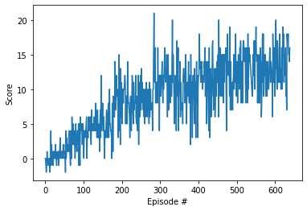

[//]: # (Image References)

# Project 1: Navigation

### Introduction

For this project, you will train an agent to navigate (and collect bananas!) in a large, square world.  

A reward of +1 is provided for collecting a yellow banana, and a reward of -1 is provided for collecting a blue banana.  Thus, the goal of your agent is to collect as many yellow bananas as possible while avoiding blue bananas.  

The state space has 37 dimensions and contains the agent's velocity, along with ray-based perception of objects around agent's forward direction.  Given this information, the agent has to learn how to best select actions.  Four discrete actions are available, corresponding to:
- **`0`** - move forward.
- **`1`** - move backward.
- **`2`** - turn left.
- **`3`** - turn right.

The task is episodic, and in order to solve the environment, your agent must get an average score of +13 over 100 consecutive episodes.

### Getting Started

1. Download the environment from one of the links below.  You need only select the environment that matches your operating system:
    - Linux: [click here](https://s3-us-west-1.amazonaws.com/udacity-drlnd/P1/Banana/Banana_Linux.zip)
    - Mac OSX: [click here](https://s3-us-west-1.amazonaws.com/udacity-drlnd/P1/Banana/Banana.app.zip)
    - Windows (32-bit): [click here](https://s3-us-west-1.amazonaws.com/udacity-drlnd/P1/Banana/Banana_Windows_x86.zip)
    - Windows (64-bit): [click here](https://s3-us-west-1.amazonaws.com/udacity-drlnd/P1/Banana/Banana_Windows_x86_64.zip)
    
    (_For Windows users_) Check out [this link](https://support.microsoft.com/en-us/help/827218/how-to-determine-whether-a-computer-is-running-a-32-bit-version-or-64) if you need help with determining if your computer is running a 32-bit version or 64-bit version of the Windows operating system.

    (_For AWS_) If you'd like to train the agent on AWS (and have not [enabled a virtual screen](https://github.com/Unity-Technologies/ml-agents/blob/master/docs/Training-on-Amazon-Web-Service.md)), then please use [this link](https://s3-us-west-1.amazonaws.com/udacity-drlnd/P1/Banana/Banana_Linux_NoVis.zip) to obtain the environment.

2. Place the file in this folder, unzip (or decompress) the file and then write the correct path in the argument for creating the environment under the notebook `python\Navigation.ipynb`:

```python
env = UnityEnvironment(file_name=r"..\p1_navigation\Banana_Windows_x86_64\Banana.exe")

```

### Description

- `python\dqn_agent.py`: code for the agent used in the environment
- `python\model.py`: code containing the Q-Network used as the function approximator by the agent
- `python\dddqn.pth`: saved model weights for the Dueling Double DQN model
- `python\Navigation_solution.ipynb`: notebook containing the solution

### Instructions

Follow the instructions in `python\Navigation.ipynb` to get started with training your own agent! 
To watch a trained smart agent, follow the instructions below:

- **Dueling Double DQN**: If you want to run the Dueling Double DQN algorithm, use the checkpoint `dddqn.pth` for loading the trained model. Also, choose the parameter `qnetwork` as `DuelingQNetwork` while defining the agent and the parameter `update_type` as `double_dqn`.

### Enhancements

Several enhancements to the original DQN algorithm have also been incorporated:

- Dueling DQN [[Paper](https://arxiv.org/abs/1511.06581)], Code in 'python/model.py'

### Results

Plot showing the score per episode over all the episodes. The environment was solved in **639** episodes (currently).

| Dueling DQN |
:-------------------------:
 

### Dependencies

Use the `python\requirements.txt` file to install the required dependencies via `pip`.

```
pip install -r python\requirements.txt

```
